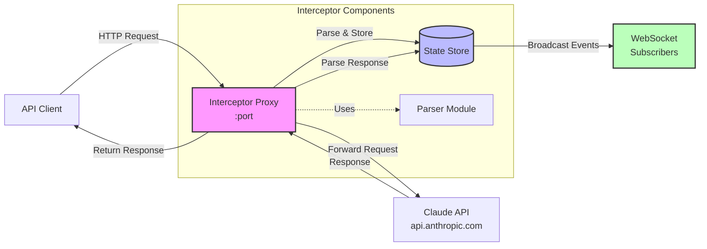

# Interceptor

The Interceptor package is a transparent HTTP proxy server designed to intercept, parse, and monitor API requests and responses to the Anthropic Claude API. It acts as a middleware layer that captures both streaming and non-streaming API communications, providing real-time visibility into the request/response cycle while forwarding traffic seamlessly to the actual API endpoints.

Built with Rust and Axum, the interceptor supports WebSocket connections for live monitoring of intercepted traffic. It parses Claude API message formats, tracks conversation flows, and handles streaming responses efficiently. The package is particularly useful for debugging API interactions, monitoring token usage, and understanding the structure of Claude API communications in development environments.

## Flow Diagram

